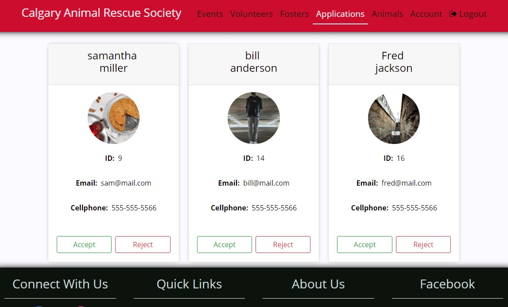

#  C.A.R.S. Volunteer System

  ## Problem
CARS is using an external volunteer management system. The client would like a new system that fits their needs better as the existing system has many features that they do not utilize. Given that it is a pay to use system, the end goal is to take CARS off of it and build a system that is more in line with their day to day activities. 
They also used an external application management system. This application system handles dog and cat adoption forms as well as foster applications. They would like to move off this system to both save money and to have all their services concentrated into one application. 
The major goal of this project was to build and deploy a system that handles the organization’s volunteers and forms.

  ## Solution
A full stack web application that allows to manage application forms, volunteers, animals, and events easily, and helps both clients and users have better experience when dealing with application forms, event registration, and password recovery.
The two systems (front and back end) are packaged into a web application that is accessible from any internet browser. The system is built using the Angular Framework and the Spring Framework. Languages used include: Java, SQL, HTML, CSS and TypeScript.
  
  ## Result
As a result, of the new system developed, CARS are able to significantly reduce the cost of managing their day to day activities. The new system is able to manage adoption forms, foster/volunteer application forms, and events. CARS chairs are admins for the system, and can manage the forms, the personnel and the events. They can view forms and either accept or reject them. They can manage fosters and volunteers that belong to CARS. They can also create and manage events for the organization. Fosters and volunteers of CARS have access to their account details and are able to edit them as well as view events that the chairs have created and register/unregister from them. This system ensures that all the essential services that are currently used at CARS are concentrated into one place instead of being scattered across multiple applications. 

# System Design

## Layered Architecture
The system is divided into two parts, the frontend component utilizing Angular and the backend component utilizing Java with Spring. The system functions by having frontend as a single page application that consumes RESTful endpoints provided by the Java backend. URLs are mapped to endpoints that the frontend can make HTTP requests to. 

## Hardware Architecture
The server for the application is hosted an unmanaged VPS hosting service provided by a2hosting. This service supports exported Angular projects and can run Java applications. It utilizes Apache and Apache Tomcat to run the system. The system will run so long as the server is running.

## Hardware Platform
The application runs on Linux, Mac, or Windows, so long as it is equipped any common web browser (Firefox, Edge, IE, Safari, Chrome, Opera).

## Software Platform
The software required to run the product includes the following stack:
•	HTML/CSS
•	Java JDK 1.8
•	Apache Tomcat
•	MySQL
•	Spring
•	Angular

## Security
The system uses tokens, password hashing and roles to create a secure environment. Tokens act as sessions and resource authentication. When a user logs in they are assigned a token with a unique value. This unique value must be present in all HTTP headers in order to access data from the REST endpoints. Without this value the REST endpoint will not return any data, therefore anyone without the proper permissions will not have access to any data they shouldn’t have access to. The token is also used to keep track of sessions and when the user logs out or a certain amount of time has passed, the token is invalidated and the user must login again to use the application. Passwords are hashed in our system and not stored as plain text. This is an industry best practice and thus was implemented in the system.

# Reference Materials
### Admin-side events page

### Admin-side applications page

